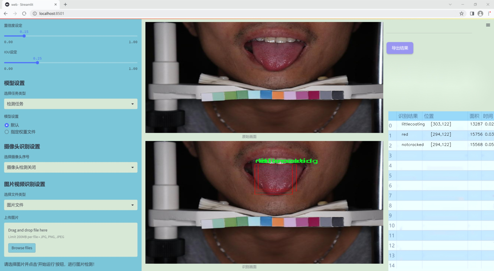
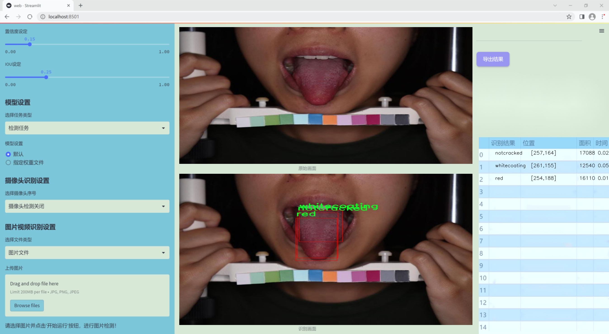
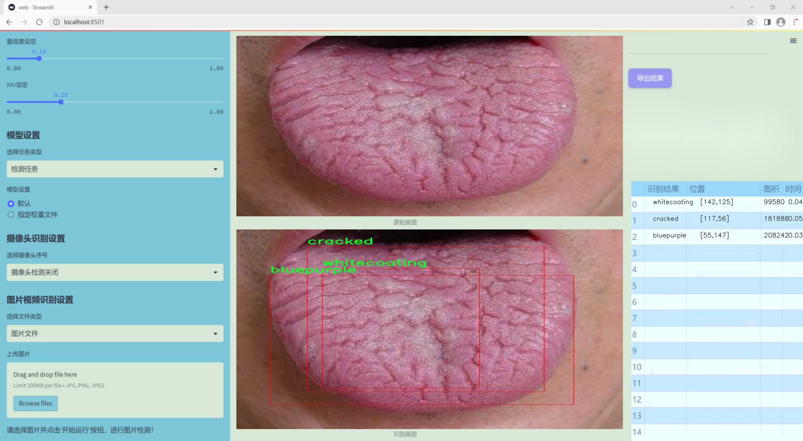
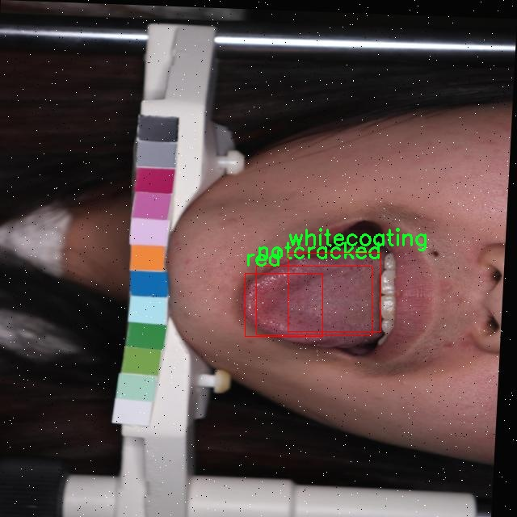
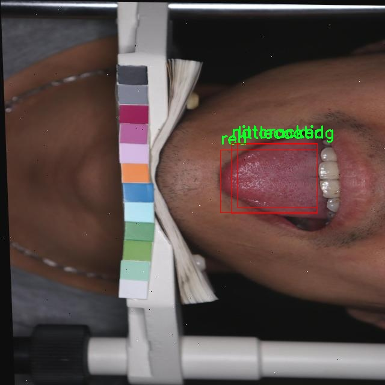
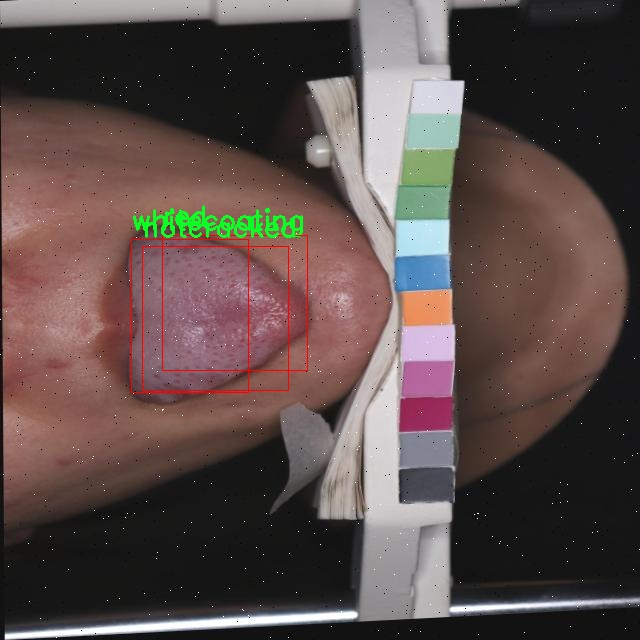
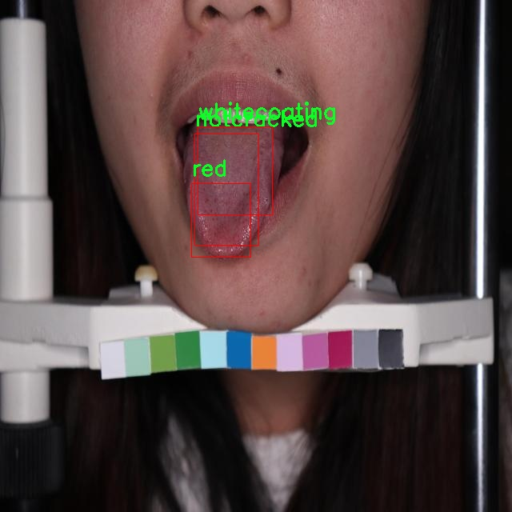
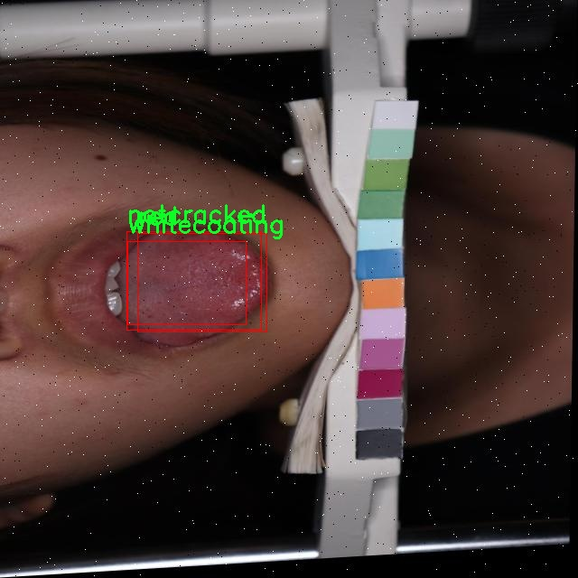

### 1.背景意义

研究背景与意义

中医舌苔作为中医诊断的重要组成部分，能够反映出人体内脏的健康状况和气血的变化。舌苔的颜色、形态及厚度等特征，常常被中医师用来辅助判断疾病的性质和发展阶段。随着现代医学技术的发展，传统的舌苔观察方法逐渐向数字化、智能化转型。基于计算机视觉的舌苔分类检测系统应运而生，能够通过高效、准确的方式分析舌苔特征，辅助中医诊断。

本研究旨在基于改进的YOLOv11模型，构建一个高效的中医舌苔分类检测系统。该系统将针对舌苔的八种主要类型进行分类，包括蓝紫色、裂纹、薄苔、不裂纹、苍白、红色、白苔和黄苔。通过对487幅舌苔图像的深度学习训练，系统将能够自动识别和分类不同类型的舌苔，为中医诊断提供有力的技术支持。

数据集的构建和预处理过程为模型的训练提供了坚实的基础。通过多种数据增强技术，研究确保了模型的鲁棒性和泛化能力。这些技术不仅增加了数据的多样性，还提高了模型在实际应用中的适应性。此外，改进的YOLOv11模型在目标检测领域表现出色，其高效的特征提取能力和实时检测性能，将为舌苔分类提供更加精准的解决方案。

综上所述，基于改进YOLOv11的中医舌苔分类检测系统，不仅为中医诊断提供了现代化的工具，也为推动中医与人工智能的深度融合开辟了新的方向。通过本研究的开展，期望能够提升舌苔分析的效率和准确性，进而促进中医的科学化和规范化发展。

### 2.视频效果

[2.1 视频效果](https://www.bilibili.com/video/BV1DZm8YaEzt/)

### 3.图片效果







##### [项目涉及的源码数据来源链接](https://kdocs.cn/l/cszuIiCKVNis)**

注意：本项目提供训练的数据集和训练教程,由于版本持续更新,暂不提供权重文件（best.pt）,请按照6.训练教程进行训练后实现上图演示的效果。

### 4.数据集信息

##### 4.1 本项目数据集类别数＆类别名

nc: 8
names: ['bluepurple', 'cracked', 'littlecoating', 'notcracked', 'pale', 'red', 'whitecoating', 'yellowcoating']


该项目为【目标检测】数据集，请在【训练教程和Web端加载模型教程（第三步）】这一步的时候按照【目标检测】部分的教程来训练

##### 4.2 本项目数据集信息介绍

本项目数据集信息介绍

本项目旨在开发一种改进的YOLOv11中医舌苔分类检测系统，为了实现这一目标，我们构建了一个专门针对舌苔特征的多类别数据集。该数据集包含8个不同的舌苔类别，分别为：蓝紫色、裂纹、薄苔、无裂纹、苍白、红色、白苔和黄苔。这些类别的选择是基于中医理论中对舌苔的分类标准，旨在为舌苔的分析和诊断提供更为细致的支持。

数据集的构建过程涵盖了多种舌苔图像的采集，确保了样本的多样性和代表性。每个类别的图像均经过精心挑选，确保能够准确反映出不同舌苔的特征。例如，蓝紫色舌苔通常与气血不足或寒湿内盛相关，而红色舌苔则可能指示体内热邪的存在。通过对这些舌苔特征的细致分类，我们的目标是提高模型在舌苔分析中的准确性和鲁棒性。

在数据集的标注过程中，我们采用了专业的中医医师进行审核，以确保每个图像的类别标注符合中医理论的标准。这一过程不仅提升了数据集的质量，也为后续的模型训练提供了可靠的基础。通过使用这一数据集，我们期望改进YOLOv11的性能，使其在舌苔分类检测任务中能够实现更高的准确率和更快的响应速度，从而为中医诊断提供更加高效的技术支持。











### 5.全套项目环境部署视频教程（零基础手把手教学）

[5.1 所需软件PyCharm和Anaconda安装教程（第一步）](https://www.bilibili.com/video/BV1BoC1YCEKi/?spm_id_from=333.999.0.0&vd_source=bc9aec86d164b67a7004b996143742dc)


[5.2 安装Python虚拟环境创建和依赖库安装视频教程（第二步）](https://www.bilibili.com/video/BV1ZoC1YCEBw?spm_id_from=333.788.videopod.sections&vd_source=bc9aec86d164b67a7004b996143742dc)

### 6.改进YOLOv11训练教程和Web_UI前端加载模型教程（零基础手把手教学）

[6.1 改进YOLOv11训练教程和Web_UI前端加载模型教程（第三步）](https://www.bilibili.com/video/BV1BoC1YCEhR?spm_id_from=333.788.videopod.sections&vd_source=bc9aec86d164b67a7004b996143742dc)


按照上面的训练视频教程链接加载项目提供的数据集，运行train.py即可开始训练



     Epoch   gpu_mem       box       obj       cls    labels  img_size
     1/200     20.8G   0.01576   0.01955  0.007536        22      1280: 100%|██████████| 849/849 [14:42<00:00,  1.04s/it]
               Class     Images     Labels          P          R     mAP@.5 mAP@.5:.95: 100%|██████████| 213/213 [01:14<00:00,  2.87it/s]
                 all       3395      17314      0.994      0.957      0.0957      0.0843

     Epoch   gpu_mem       box       obj       cls    labels  img_size
     2/200     20.8G   0.01578   0.01923  0.007006        22      1280: 100%|██████████| 849/849 [14:44<00:00,  1.04s/it]
               Class     Images     Labels          P          R     mAP@.5 mAP@.5:.95: 100%|██████████| 213/213 [01:12<00:00,  2.95it/s]
                 all       3395      17314      0.996      0.956      0.0957      0.0845

     Epoch   gpu_mem       box       obj       cls    labels  img_size
     3/200     20.8G   0.01561    0.0191  0.006895        27      1280: 100%|██████████| 849/849 [10:56<00:00,  1.29it/s]
               Class     Images     Labels          P          R     mAP@.5 mAP@.5:.95: 100%|███████   | 187/213 [00:52<00:00,  4.04it/s]
                 all       3395      17314      0.996      0.957      0.0957      0.0845


###### [项目数据集下载链接](https://kdocs.cn/l/cszuIiCKVNis)

### 7.原始YOLOv11算法讲解


##### YOLOv11三大损失函数

YOLOv11（You Only Look Once）是一种流行的目标检测算法，其损失函数设计用于同时优化分类和定位任务。YOLO的损失函数通常包括几个部分：
**分类损失、定位损失（边界框回归损失）和置信度损失** 。其中，

  1. box_loss（边界框回归损失）是用于优化预测边界框与真实边界框之间的差异的部分。

  2. cls_loss（分类损失）是用于优化模型对目标类别的预测准确性的部分。分类损失确保模型能够正确地识别出图像中的对象属于哪个类别。

  3. dfl_loss（Distribution Focal Loss）是YOLO系列中的一种损失函数，特别是在一些改进版本如YOLOv5和YOLOv7中被引入。它的主要目的是解决目标检测中的类别不平衡问题，并提高模型在处理小目标和困难样本时的性能。

##### 边界框回归损失详解

box_loss（边界框回归损失）是用于优化预测边界框与真实边界框之间的差异的部分。


##### box_loss 的具体意义


##### 为什么需要 box_loss

  * 精确定位：通过最小化中心点坐标损失和宽高损失，模型能够更准确地预测目标的位置和大小。
  * 平衡不同类型的目标：使用平方根来处理宽高损失，可以更好地平衡不同大小的目标，确保小目标也能得到足够的关注。
  * 稳定训练：适当的损失函数设计有助于模型的稳定训练，避免梯度爆炸或消失等问题。

##### 分类损失详解

在YOLO（You Only Look
Once）目标检测算法中，cls_loss（分类损失）是用于优化模型对目标类别的预测准确性的部分。分类损失确保模型能够正确地识别出图像中的对象属于哪个类别。下面是关于cls_loss的详细解读：

##### 分类损失 (cls_loss) 的具体意义

  
分类损失通常使用交叉熵损失（Cross-Entropy
Loss）来计算。交叉熵损失衡量的是模型预测的概率分布与真实标签之间的差异。在YOLO中，分类损失的具体形式如下：


##### 为什么需要 cls_loss

  * 类别识别：cls_loss 确保模型能够正确识别出图像中的目标属于哪个类别。这对于目标检测任务至关重要，因为不仅需要知道目标的位置，还需要知道目标的类型。

  * 多类别支持：通过最小化分类损失，模型可以处理多个类别的目标检测任务。例如，在道路缺陷检测中，可能需要识别裂缝、坑洞、路面破损等多种类型的缺陷。

  * 提高准确性：分类损失有助于提高模型的分类准确性，从而提升整体检测性能。通过优化分类损失，模型可以更好地学习不同类别之间的特征差异。

##### 分布损失详解

`dfl_loss`（Distribution Focal
Loss）是YOLO系列中的一种损失函数，特别是在一些改进版本如YOLOv5和YOLOv7中被引入。它的主要目的是解决目标检测中的类别不平衡问题，并提高模型在处理小目标和困难样本时的性能。下面是对`dfl_loss`的详细解读：

##### DFL Loss 的背景

在目标检测任务中，类别不平衡是一个常见的问题。某些类别的样本数量可能远远多于其他类别，这会导致模型在训练过程中对常见类别的学习效果较好，而对罕见类别的学习效果较差。此外，小目标和困难样本的检测也是一个挑战，因为这些目标通常具有较少的特征信息，容易被忽略或误分类。

为了应对这些问题，研究者们提出了多种改进方法，其中之一就是`dfl_loss`。`dfl_loss`通过引入分布焦点损失来增强模型对困难样本的关注，并改善类别不平衡问题。

##### DFL Loss 的定义

DFL Loss
通常与传统的交叉熵损失结合使用，以增强模型对困难样本的学习能力。其核心思想是通过对每个类别的预测概率进行加权，使得模型更加关注那些难以正确分类的样本。

DFL Loss 的公式可以表示为：


##### DFL Loss 的具体意义**

  * **类别不平衡：** 通过引入平衡因子 α，DFL Loss 可以更好地处理类别不平衡问题。对于少数类别的样本，可以通过增加其权重来提升其重要性，从而提高模型对这些类别的检测性能。
  *  **困难样本：** 通过聚焦参数 γ，DFL Loss 可以让模型更加关注那些难以正确分类的样本。当 
  * γ 较大时，模型会对那些预测概率较低的样本给予更多的关注，从而提高这些样本的分类准确性。
  *  **提高整体性能** ：DFL Loss 结合了传统交叉熵损失的优势，并通过加权机制增强了模型对困难样本的学习能力，从而提高了整体的检测性能。


### 8.200+种全套改进YOLOV11创新点原理讲解

#### 8.1 200+种全套改进YOLOV11创新点原理讲解大全

由于篇幅限制，每个创新点的具体原理讲解就不全部展开，具体见下列网址中的改进模块对应项目的技术原理博客网址【Blog】（创新点均为模块化搭建，原理适配YOLOv5~YOLOv11等各种版本）

[改进模块技术原理博客【Blog】网址链接](https://gitee.com/qunmasj/good)


#### 8.2 精选部分改进YOLOV11创新点原理讲解

###### 这里节选部分改进创新点展开原理讲解(完整的改进原理见上图和[改进模块技术原理博客链接](https://gitee.com/qunmasj/good)【如果此小节的图加载失败可以通过CSDN或者Github搜索该博客的标题访问原始博客，原始博客图片显示正常】
### 深度学习基础
卷积神经网络通过使用具有共享参数的卷积运算显著降低了模型的计算开销和复杂性。在LeNet、AlexNet和VGG等经典网络的驱动下，卷积神经网络现在已经建立了一个完整的系统，并在深度学习领域形成了先进的卷积神经网络模型。

感受野注意力卷积RFCBAMConv的作者在仔细研究了卷积运算之后获得了灵感。对于分类、目标检测和语义分割任务，一方面，图像中不同位置的对象的形状、大小、颜色和分布是可变的。在卷积操作期间，卷积核在每个感受野中使用相同的参数来提取信息，而不考虑来自不同位置的差分信息。这限制了网络的性能，这已经在最近的许多工作中得到了证实。

另一方面，卷积运算没有考虑每个特征的重要性，这进一步影响了提取特征的有效性，并最终限制了模型的性能。此外，注意力机制允许模型专注于重要特征，这可以增强特征提取的优势和卷积神经网络捕获详细特征信息的能力。因此，注意力机制在深度学习中得到了广泛的应用，并成功地应用于各个领域。

通过研究卷积运算的内在缺陷和注意力机制的特点，作者认为现有的空间注意力机制从本质上解决了卷积运算的参数共享问题，但仍局限于对空间特征的认知。对于较大的卷积核，现有的空间注意力机制并没有完全解决共享参数的问题。此外，他们无法强调感受野中每个特征的重要性，例如现有的卷积块注意力模块（CBAM）和 Coordinate注意力（CA）。

因此，[参考该博客提出了一种新的感受野注意力机制（RFA）](https://qunmasj.com)，它完全解决了卷积核共享参数的问题，并充分考虑了感受野中每个特征的重要性。通过RFA设计的卷积运算（RFAConv）是一种新的卷积运算，可以取代现有神经网络中的标准卷积运算。RFAConv通过添加一些参数和计算开销来提高网络性能。

大量关于Imagnet-1k、MS COCO和VOC的实验已经证明了RFAConv的有效性。作为一种由注意力构建的新型卷积运算，它超过了由CAM、CBAM和CA构建的卷积运算（CAMConv、CBAMConv、CAConv）以及标准卷积运算。

此外，为了解决现有方法提取感受野特征速度慢的问题，提出了一种轻量级操作。在构建RFAConv的过程中，再次设计了CA和CBAM的升级版本，并进行了相关实验。作者认为当前的空间注意力机制应该将注意力放在感受野空间特征上，以促进当前空间注意力机制的发展，并再次增强卷积神经网络架构的优势。


### 卷积神经网络架构
出色的神经网络架构可以提高不同任务的性能。卷积运算作为卷积神经网络的一种基本运算，推动了人工智能的发展，并为车辆检测、无人机图像、医学等先进的网络模型做出了贡献。He等人认为随着网络深度的增加，该模型将变得难以训练并产生退化现象，因此他们提出了残差连接来创新卷积神经网络架构的设计。Huang等人通过重用特征来解决网络梯度消失问题，增强了特征信息，他们再次创新了卷积神经网络架构。

通过对卷积运算的详细研究，Dai等人认为，具有固定采样位置的卷积运算在一定程度上限制了网络的性能，因此提出了Deformable Conv，通过学习偏移来改变卷积核的采样位置。在Deformable Conv的基础上，再次提出了Deformable Conv V2和Deformable Conv V3，以提高卷积网络的性能。

Zhang等人注意到，组卷积可以减少模型的参数数量和计算开销。然而，少于组内信息的交互将影响最终的网络性能。1×1的卷积可以与信息相互作用。然而，这将带来更多的参数和计算开销，因此他们提出了无参数的“通道Shuffle”操作来与组之间的信息交互。

Ma等人通过实验得出结论，对于参数较少的模型，推理速度不一定更快，对于计算量较小的模型，推理也不一定更快。经过仔细研究提出了Shufflenet V2。

YOLO将输入图像划分为网格，以预测对象的位置和类别。经过不断的研究，已经提出了8个版本的基于YOLO的目标检测器，如YOLOv11、YOLOv11、YOLOv11等。上述卷积神经网络架构已经取得了巨大的成功。然而，它们并没有解决提取特征过程中的参数共享问题。本文的工作从注意力机制开始，从一个新的角度解决卷积参数共享问题。

### 注意力机制
注意力机制被用作一种提高网络模型性能的技术，使其能够专注于关键特性。注意力机制理论已经在深度学习中建立了一个完整而成熟的体系。Hu等人提出了一种Squeeze-and-Excitation（SE）块，通过压缩特征来聚合全局通道信息，从而获得与每个通道对应的权重。Wang等人认为，当SE与信息交互时，单个通道和权重之间的对应关系是间接的，因此设计了高效通道注Efficient Channel Attention力（ECA），并用自适应kernel大小的一维卷积取代了SE中的全连接（FC）层。Woo等人提出了卷积块注意力模块（CBAM），它结合了通道注意力和空间注意力。作为一个即插即用模块，它可以嵌入卷积神经网络中，以提高网络性能。

尽管SE和CBAM已经提高了网络的性能。Hou等人仍然发现压缩特征在SE和CBAM中丢失了太多信息。因此，他们提出了轻量级Coordinate注意力（CA）来解决SE和CBAM中的问题。Fu等人计了一个空间注意力模块和通道注意力模块，用于扩展全卷积网络（FCN），分别对空间维度和通道维度的语义相关性进行建模。Zhang等人在通道上生成不同尺度的特征图，以建立更有效的通道注意力机制。

本文从一个新的角度解决了标准卷积运算的参数共享问题。这就是将注意力机制结合起来构造卷积运算。尽管目前的注意力机制已经获得了良好的性能，但它们仍然没有关注感受野的空间特征。因此，设计了具有非共享参数的RFA卷积运算，以提高网络的性能。


#### 回顾标准卷积
以标准卷积运算为基础构建卷积神经网络，通过共享参数的滑动窗口提取特征信息，解决了全连接层构建的神经网络的固有问题（即参数数量大、计算开销高）。

设表示输入特征图，其中、和分别表示特征图的通道数、高度和宽度。为了能够清楚地展示卷积核提取特征信息的过程，以为例。提取每个感受野slider的特征信息的卷积运算可以表示如下：


这里，表示在每次卷积slider操作之后获得的值，表示在每个slider内的相应位置处的像素值。表示卷积核，表示卷积核中的参数数量，表示感受野slider的总数。

可以看出，每个slider内相同位置的特征共享相同的参数。因此，标准的卷积运算无法感知不同位置带来的差异信息，这在一定程度上限制了卷积神经网络的性能。

#### 回顾空间注意力
目前，空间注意力机制使用通过学习获得的注意力图来突出每个特征的重要性。与上一节类似，以为例。突出关键特征的空间注意力机制可以简单地表达如下：


这里，表示在加权运算之后获得的值。和分别表示输入特征图和学习注意力图在不同位置的值，是输入特征图的高度和宽度的乘积，表示像素值的总数。一般来说，整个过程可以简单地表示在图1中。


#### 空间注意力与标准卷积
众所周知，将注意力机制引入卷积神经网络可以提高网络的性能。通过标准的卷积运算和对现有空间注意力机制的仔细分析。作者认为空间注意力机制本质上解决了卷积神经网络的固有缺点，即共享参数的问题。

目前，该模型最常见的卷积核大小为1×1和3×3。引入空间注意力机制后用于提取特征的卷积操作是1×1或3×3卷积操作。这个过程可以直观地显示出来。空间注意力机制被插入到1×1卷积运算的前面。通过注意力图对输入特征图进行加权运算（Re-weight“×”），最后通过1×1卷积运算提取感受野的slider特征信息。

整个过程可以简单地表示如下：


 

这里，卷积核仅表示一个参数值。如果将的值作为一个新的卷积核参数，那么有趣的是，通过1×1卷积运算提取特征时的参数共享问题得到了解决。然而，空间注意力机制的传说到此结束。当空间注意力机制被插入到3×3卷积运算的前面时。具体情况如下：


如上所述，如果取的值。作为一种新的卷积核参数，上述方程完全解决了大规模卷积核的参数共享问题。然而，最重要的一点是，卷积核在每个感受野slider中提取将共享部分特征的特征。换句话说，在每个感受野slider内都会有重叠。

经过仔细分析发现，，…，空间注意力图的权重在每个slider内共享。因此，空间注意机制不能解决大规模卷积核共享参数的问题，因为它们不注意感受野的空间特征。在这种情况下，空间注意力机制是有限的。
#### 创新空间注意力与标准卷积
RFA是为了解决空间注意力机制问题而提出的，创新了空间注意力。使用与RFA相同的思想，一系列空间注意力机制可以再次提高性能。RFA设计的卷积运算可以被视为一种轻量级的即插即用模块，以取代标准卷积，从而提高卷积神经网络的性能。因此，作者认为空间注意力机制和标准卷积在未来将有一个新的春天。

感受野的空间特征：

现在给出感受野空间特征的定义。它是专门为卷积核设计的，并根据kernel大小动态生成，如图2所示，以3×3卷积核为例。


在图2中，“空间特征”表示原始特征图，等于空间特征。“感受野空间特征”表示变换后的特征，该特征由每个感受野slider滑块组成，并且不重叠。也就是说，“感受野空间特征”中的每个3×3大小的slider表示提取原始3×3卷积特征时所有感觉野slider的特征。

#### 感受野注意力卷积(RFA):

关于感受野空间特征，该博客的作者提出了感受野注意（RFA），它不仅强调了感受野slider内各种特征的重要性，而且还关注感受野空间特性，以彻底解决卷积核参数共享的问题。感受野空间特征是根据卷积核的大小动态生成的，因此，RFA是卷积的固定组合，不能脱离卷积运算的帮助，卷积运算同时依赖RFA来提高性能。

因此，作者提出了感受野注意力卷积（RFAConv）。具有3×3大小卷积核的RFAConv的总体结构如图3所示。


目前，提取感受野特征最常用的方法速度较慢，因此经过不断探索提出了一种快速的方法，通过分组卷积来取代原来的方法。

具体来说，根据感受野大小，使用相应的组卷积大小来动态生成展开特征。尽管与原始的无参数方法（如Pytorch提供的nn.Unfld()）相比，该方法添加了一些参数，但速度要快得多。

注意：正如在上一节中提到的，当原始的3×3卷积核提取特征时，感受野空间特征中的每个3×3大小的窗口表示所有感受野滑块的特征。但在快速分组卷积提取感受野特征后，由于原始方法太慢，它们会被映射到新的特征中。

最近的一些工作已经证明信息交互可以提高网络性能。类似地，对于RFAConv，与感受野特征信息交互以学习注意力图可以提高网络性能，但与每个感受野特征交互将带来额外的计算开销。为了确保少量的计算开销和参数数量，通过探索使用AvgPool池化每个感受野特征的全局信息，然后通过1×1组卷积运算与信息交互。最后，softmax用于强调感受野特征中每个特征的重要性。通常，RFA的计算可以表示为：


表示分组卷积，表示卷积核的大小，代表规范化，表示输入特征图，是通过将注意力图与变换的感受野空间特征相乘而获得的。

与CBAM和CA不同，RFA可以为每个感受野特征生成注意力图。标准卷积受到卷积神经网络性能的限制，因为共享参数的卷积运算对位置带来的差异信息不敏感。RFA完全可以解决这个问题，具体细节如下：


由于RFA获得的特征图是“调整形状”后不重叠的感受野空间特征，因此通过池化每个感受野滑块的特征信息来学习学习的注意力图。换句话说，RFA学习的注意力图不再在每个感受野slider内共享，并且是有效的。这完全解决了现有的CA和CBAM对大尺寸kernel的注意力机制中的参数共享问题。

同时，RFA给标准卷积核带来了相当大的好处，但调整形状后，特征的高度和宽度是k倍，需要进行k×k的stride卷积运算，才能提取特征信息。RFAConv创新了标准卷积运算。

此外，空间注意力机制将得到升级，因为作者认为现有的空间注意力机制应该专注于感受野空间特征，以提高网络的性能。众所周知，基于自注意力机制的网络模型取得了巨大的成功，因为它解决了卷积参数共享的问题，并对远程信息进行了建模，但基于自注意力机理的方法给模型带来了巨大的计算开销和复杂性。作者认为通过将一些现有空间注意力机制的注意力放在感受野空间特征中，它以轻量级的方式解决了自注意力机制的问题。

答案如下：

将关注感受野空间特征的空间注意力与卷积相匹配，完全解决了卷积参数共享的问题；

当前的空间注意力机制本身具有考虑远距离信息的特点，它们通过全局平均池化或全局最大池化来获得全局信息，这在一定程度上考虑了远距离信息。


为此，作者设计了一种新的CBAM和CA，称为RFACBAM和RFACA，它专注于感受野的空间特征。与RFA类似，使用stride为k的k×k的最终卷积运算来提取特征信息，具体结构如图4和图5所示，将这2种新的卷积方法称为RFCBAMConv和RFCAConv。比较原始的CBAM，使用SE注意力来代替RFCBAM中的CAM。因为这样可以减少计算开销。


此外，在RFCBAM中，通道和空间注意力不是在单独的步骤中执行的，因为通道和空间注意力是同时加权的，从而允许在每个通道上获得的注意力图是不同的。


### 9.系统功能展示

图9.1.系统支持检测结果表格显示

  图9.2.系统支持置信度和IOU阈值手动调节

  图9.3.系统支持自定义加载权重文件best.pt(需要你通过步骤5中训练获得)

  图9.4.系统支持摄像头实时识别

  图9.5.系统支持图片识别

  图9.6.系统支持视频识别

  图9.7.系统支持识别结果文件自动保存

  图9.8.系统支持Excel导出检测结果数据


### 10. YOLOv11核心改进源码讲解

#### 10.1 TransNext.py

以下是对提供代码的逐行分析和核心部分的保留，同时添加了详细的中文注释：

```python
try:
    # 尝试导入swattention模块和TransNext_cuda中的所有内容
    import swattention
    from ultralytics.nn.backbone.TransNeXt.TransNext_cuda import *
except ImportError as e:
    # 如果导入失败（可能是因为没有安装swattention或TransNext_cuda），则导入TransNext_native中的所有内容
    from ultralytics.nn.backbone.TransNeXt.TransNext_native import *
    pass
```

### 核心部分分析：
1. **模块导入**：
   - 代码首先尝试导入`swattention`模块和`TransNext_cuda`中的内容，这表明程序依赖于这些模块的功能。
   - 如果这些模块未能成功导入（例如，环境中缺少相关库），则会捕获`ImportError`异常，并尝试导入`TransNext_native`模块。

2. **异常处理**：
   - 使用`try...except`结构来处理可能的导入错误，确保程序的健壮性，即使在缺少某些依赖的情况下也能继续运行。

### 重要性：
- 这种导入方式允许程序在不同的环境中灵活适应，确保即使在缺少CUDA支持的情况下，程序也能使用CPU版本的实现（`TransNext_native`），从而增强了代码的兼容性和可移植性。

### 总结：
这段代码的核心在于通过条件导入来确保程序的可用性，适应不同的运行环境，避免因缺少依赖而导致的程序崩溃。

这段代码是一个Python脚本，主要用于导入所需的模块和类。首先，它尝试导入名为`swattention`的模块，以及从`ultralytics.nn.backbone.TransNeXt`路径下导入`TransNext_cuda`。这个模块可能是与深度学习或计算机视觉相关的，尤其是在使用CUDA进行加速时。

如果在导入`swattention`或`TransNext_cuda`时发生`ImportError`异常，代码会捕获这个异常，并尝试导入`TransNext_native`，这是一个可能不依赖于CUDA的替代实现。这种做法通常用于确保在不同的运行环境中都能找到合适的模块，特别是在某些环境中可能没有CUDA支持的情况下。

整体来看，这段代码的设计是为了提高程序的兼容性和灵活性，确保在不同的硬件和软件环境中都能正常运行。通过这种方式，开发者可以在支持CUDA的环境中利用GPU加速，而在不支持的环境中则回退到CPU实现。

#### 10.2 head.py

以下是代码中最核心的部分，保留了YOLOv8检测头的实现，并添加了详细的中文注释：

```python
import torch
import torch.nn as nn
import torch.nn.functional as F
from ..modules import Conv, DFL, make_anchors, dist2bbox

class Detect_DyHead(nn.Module):
    """YOLOv8检测头，使用动态头进行目标检测。"""
    
    def __init__(self, nc=80, hidc=256, block_num=2, ch=()):
        """
        初始化检测头的参数。
        
        参数:
        nc (int): 类别数量，默认为80。
        hidc (int): 隐藏层通道数，默认为256。
        block_num (int): 动态头块的数量，默认为2。
        ch (tuple): 输入通道数的元组。
        """
        super().__init__()
        self.nc = nc  # 类别数量
        self.nl = len(ch)  # 检测层的数量
        self.reg_max = 16  # DFL通道数
        self.no = nc + self.reg_max * 4  # 每个锚点的输出数量
        self.stride = torch.zeros(self.nl)  # 构建时计算的步幅
        self.conv = nn.ModuleList(nn.Sequential(Conv(x, hidc, 1)) for x in ch)  # 输入通道的卷积层
        self.dyhead = nn.Sequential(*[DyHeadBlock(hidc) for _ in range(block_num)])  # 动态头块
        self.cv2 = nn.ModuleList(
            nn.Sequential(Conv(hidc, hidc // 4, 3), Conv(hidc // 4, hidc // 4, 3), nn.Conv2d(hidc // 4, 4 * self.reg_max, 1)) for _ in ch
        )  # 生成框的卷积层
        self.cv3 = nn.ModuleList(
            nn.Sequential(
                nn.Sequential(Conv(hidc, hidc, 3), Conv(hidc, hidc, 1)),
                nn.Conv2d(hidc, self.nc, 1),
            )
            for _ in ch
        )  # 类别的卷积层
        self.dfl = DFL(self.reg_max) if self.reg_max > 1 else nn.Identity()  # DFL层

    def forward(self, x):
        """前向传播，返回预测的边界框和类别概率。"""
        for i in range(self.nl):
            x[i] = self.conv[i](x[i])  # 通过卷积层处理输入
        x = self.dyhead(x)  # 通过动态头处理
        shape = x[0].shape  # 获取输出形状
        for i in range(self.nl):
            x[i] = torch.cat((self.cv2[i](x[i]), self.cv3[i](x[i])), 1)  # 拼接生成框和类别的输出
        if self.training:
            return x  # 训练模式下返回中间结果
        else:
            # 动态锚点生成
            self.anchors, self.strides = (x.transpose(0, 1) for x in make_anchors(x, self.stride, 0.5))
            x_cat = torch.cat([xi.view(shape[0], self.no, -1) for xi in x], 2)  # 拼接所有输出
            box, cls = x_cat.split((self.reg_max * 4, self.nc), 1)  # 分割边界框和类别
            dbox = dist2bbox(self.dfl(box), self.anchors.unsqueeze(0), xywh=True, dim=1) * self.strides  # 解码边界框
            y = torch.cat((dbox, cls.sigmoid()), 1)  # 返回边界框和类别概率
            return y

    def bias_init(self):
        """初始化检测头的偏置，警告：需要步幅可用。"""
        for a, b, s in zip(self.cv2, self.cv3, self.stride):
            a[-1].bias.data[:] = 1.0  # 边界框偏置初始化
            b[-1].bias.data[:self.nc] = math.log(5 / self.nc / (640 / s) ** 2)  # 类别偏置初始化
```

### 代码核心部分解释：
1. **类定义**：`Detect_DyHead`是YOLOv8的检测头，负责生成目标检测的边界框和类别概率。
2. **初始化方法**：设置类别数量、隐藏层通道数、动态头块数量等参数，并构建卷积层和动态头。
3. **前向传播方法**：处理输入数据，生成边界框和类别概率，并在训练和推理模式下有不同的返回值。
4. **偏置初始化**：初始化边界框和类别的偏置，以提高模型的性能。

以上是YOLOv8检测头的核心实现，包含了必要的注释以帮助理解每个部分的功能。

这个程序文件 `head.py` 是一个用于 YOLOv8 目标检测模型的实现，主要定义了不同的检测头（Detect Head）类。这些类用于处理输入特征图并生成目标检测的输出，包括边界框和类别概率。以下是对文件内容的详细说明：

首先，文件导入了一些必要的库，包括 `torch` 和 `torch.nn`，以及一些自定义模块和函数。`__all__` 列表定义了可以被外部导入的类。

接下来，定义了多个检测头类，每个类都有其特定的结构和功能。主要的检测头类包括：

1. **Detect_DyHead**：这是一个动态头，用于处理检测模型。它初始化了一些参数，如类别数量、隐藏通道数、块数量等。`forward` 方法实现了前向传播，计算预测的边界框和类别概率。

2. **Detect_AFPN_P345** 和 **Detect_AFPN_P2345**：这些类实现了带有自适应特征金字塔网络（AFPN）的检测头，适用于不同的特征层组合。

3. **Detect_Efficient**：实现了高效的检测头，使用了更少的参数和计算量。

4. **DetectAux**：实现了一个辅助检测头，适用于多任务学习。

5. **Detect_LSCD** 和 **Detect_LSCSBD**：实现了轻量级共享卷积检测头，优化了计算效率。

6. **Detect_TADDH**：实现了任务动态对齐检测头，利用了任务分解的思想来处理特征。

7. **Detect_NMSFree**：实现了无非极大值抑制（NMS）的检测头，适用于需要更高效后处理的场景。

每个检测头类都实现了 `forward` 方法，负责将输入特征图经过卷积层处理，生成边界框和类别概率。类中还定义了 `bias_init` 方法，用于初始化偏置参数，以提高模型的收敛速度。

此外，文件中还定义了一些辅助类，如 `Scale` 和 `Conv_GN`，用于实现可学习的缩放参数和标准卷积操作。

最后，文件中还包含了一些用于分割和姿态估计的检测头类，如 `Segment_Efficient`、`Pose_LSCD` 和 `OBB_LSCD`，这些类扩展了目标检测的功能，支持更多的任务。

整体来看，这个文件实现了 YOLOv8 模型的检测头部分，提供了多种不同的检测头结构，以适应不同的应用场景和需求。

#### 10.3 hcfnet.py

以下是代码中最核心的部分，并附上详细的中文注释：

```python
import torch
import torch.nn as nn
import torch.nn.functional as F

class SpatialAttentionModule(nn.Module):
    def __init__(self):
        super(SpatialAttentionModule, self).__init__()
        # 定义一个2D卷积层，用于生成空间注意力图
        self.conv2d = nn.Conv2d(in_channels=2, out_channels=1, kernel_size=7, stride=1, padding=3)
        self.sigmoid = nn.Sigmoid()  # 使用Sigmoid激活函数将输出限制在0到1之间

    def forward(self, x):
        # 计算输入特征图的平均值和最大值
        avgout = torch.mean(x, dim=1, keepdim=True)  # 平均池化
        maxout, _ = torch.max(x, dim=1, keepdim=True)  # 最大池化
        # 将平均值和最大值拼接在一起
        out = torch.cat([avgout, maxout], dim=1)
        # 通过卷积层和Sigmoid激活函数生成注意力图
        out = self.sigmoid(self.conv2d(out))
        return out * x  # 将注意力图应用于输入特征图

class PPA(nn.Module):
    def __init__(self, in_features, filters) -> None:
        super().__init__()
        # 定义多个卷积层和注意力模块
        self.skip = nn.Conv2d(in_features, filters, kernel_size=1, bias=False)  # 跳跃连接
        self.c1 = nn.Conv2d(filters, filters, kernel_size=3, padding=1)
        self.c2 = nn.Conv2d(filters, filters, kernel_size=3, padding=1)
        self.c3 = nn.Conv2d(filters, filters, kernel_size=3, padding=1)
        self.sa = SpatialAttentionModule()  # 空间注意力模块
        self.drop = nn.Dropout2d(0.1)  # Dropout层
        self.bn1 = nn.BatchNorm2d(filters)  # 批归一化
        self.silu = nn.SiLU()  # SiLU激活函数

    def forward(self, x):
        # 通过跳跃连接获取特征
        x_skip = self.skip(x)
        # 通过多个卷积层处理输入
        x1 = self.c1(x)
        x2 = self.c2(x1)
        x3 = self.c3(x2)
        # 将所有特征图相加
        x = x1 + x2 + x3 + x_skip
        x = self.sa(x)  # 应用空间注意力模块
        x = self.drop(x)  # 应用Dropout
        x = self.bn1(x)  # 批归一化
        x = self.silu(x)  # 激活函数
        return x  # 返回处理后的特征图

class DASI(nn.Module):
    def __init__(self, in_features, out_features) -> None:
        super().__init__()
        self.tail_conv = nn.Conv2d(out_features, out_features, kernel_size=1)  # 尾部卷积层
        self.skips = nn.Conv2d(in_features[1], out_features, kernel_size=1)  # 跳跃连接
        self.bns = nn.BatchNorm2d(out_features)  # 批归一化
        self.silu = nn.SiLU()  # SiLU激活函数

    def forward(self, x_list):
        # 从输入列表中获取不同分辨率的特征图
        x_low, x, x_high = x_list
        x = self.skips(x)  # 通过跳跃连接处理中间特征图
        x_skip = x  # 保存跳跃连接的输出
        x = torch.chunk(x, 4, dim=1)  # 将特征图分成4个部分

        # 处理不同分辨率的特征图
        if x_high is not None:
            x_high = self.skips(x_high)
            x_high = torch.chunk(x_high, 4, dim=1)
        if x_low is not None:
            x_low = self.skips(x_low)
            x_low = F.interpolate(x_low, size=[x.size(2), x.size(3)], mode='bilinear', align_corners=True)
            x_low = torch.chunk(x_low, 4, dim=1)

        # 将不同分辨率的特征图结合
        if x_high is None:
            x0 = self.conv(torch.cat((x[0], x_low[0]), dim=1))
            x1 = self.conv(torch.cat((x[1], x_low[1]), dim=1))
            x2 = self.conv(torch.cat((x[2], x_low[2]), dim=1))
            x3 = self.conv(torch.cat((x[3], x_low[3]), dim=1))
        elif x_low is None:
            x0 = self.conv(torch.cat((x[0], x_high[0]), dim=1))
            x1 = self.conv(torch.cat((x[1], x_high[1]), dim=1))
            x2 = self.conv(torch.cat((x[2], x_high[2]), dim=1))
            x3 = self.conv(torch.cat((x[3], x_high[3]), dim=1))
        else:
            x0 = self.bag(x_low[0], x_high[0], x[0])
            x1 = self.bag(x_low[1], x_high[1], x[1])
            x2 = self.bag(x_low[2], x_high[2], x[2])
            x3 = self.bag(x_low[3], x_high[3], x[3])

        # 将处理后的特征图拼接
        x = torch.cat((x0, x1, x2, x3), dim=1)
        x = self.tail_conv(x)  # 通过尾部卷积层
        x += x_skip  # 加上跳跃连接的输出
        x = self.bns(x)  # 批归一化
        x = self.silu(x)  # 激活函数
        return x  # 返回最终输出
```

### 代码说明：
1. **SpatialAttentionModule**: 该模块实现了空间注意力机制，通过计算输入特征图的平均值和最大值来生成注意力图，并将其应用于输入特征图上。
  
2. **PPA**: 该模块是一个特征提取器，使用多个卷积层和空间注意力模块来处理输入特征图，并通过跳跃连接增强特征。

3. **DASI**: 该模块结合了不同分辨率的特征图，使用跳跃连接和卷积层进行特征融合，并应用批归一化和激活函数来生成最终输出。

这个程序文件 `hcfnet.py` 实现了一个深度学习模型的几个模块，主要用于图像处理任务。代码中使用了 PyTorch 框架，定义了多个神经网络层和模块，具体包括空间注意力模块、局部全局注意力模块、ECA（Efficient Channel Attention）、PPA（Parallel Processing Attention）和 DASI（Dynamic Attention with Skip Connections）等。

首先，`SpatialAttentionModule` 类实现了一个空间注意力机制。它通过对输入特征图进行平均池化和最大池化，生成两个特征图，然后将它们拼接在一起并通过一个卷积层和 Sigmoid 激活函数生成注意力权重。最终，输入特征图与注意力权重相乘，以增强重要特征。

接下来，`LocalGlobalAttention` 类则实现了局部和全局的注意力机制。它将输入特征图划分为小块，经过多层感知机（MLP）处理后生成局部特征，并计算注意力权重。局部特征通过余弦相似度与一个可学习的提示向量进行比较，生成掩码，最后通过一个线性变换和上采样恢复到原始特征图的尺寸。

`ECA` 类实现了一种高效的通道注意力机制。它使用自适应平均池化和一维卷积来生成通道权重，并通过 Sigmoid 激活函数来调整输入特征图的通道强度。

`PPA` 类是一个复合模块，结合了前面提到的空间注意力、ECA 和局部全局注意力。它通过多个卷积层处理输入特征，并在不同层次上应用注意力机制，最终输出经过归一化和激活函数处理的特征图。

`Bag` 类实现了一种加权融合机制，通过计算边缘注意力来结合不同来源的特征图。

最后，`DASI` 类是一个更复杂的模块，结合了来自不同尺度的特征图。它使用跳跃连接和卷积层来融合高、低分辨率特征，并通过 Bag 模块来实现动态加权融合。这个模块的设计使得模型能够更好地捕捉多尺度信息，从而提高性能。

整体来看，这个文件实现了一种先进的图像处理网络结构，利用注意力机制和多尺度特征融合来增强模型的表达能力，适用于各种计算机视觉任务。

#### 10.4 prepbn.py

以下是经过简化和详细注释的核心代码部分：

```python
import torch
import torch.nn as nn

# 定义一个自定义的批量归一化类
class RepBN(nn.Module):
    def __init__(self, channels):
        super(RepBN, self).__init__()
        # 定义一个可学习的参数 alpha，初始值为 1
        self.alpha = nn.Parameter(torch.ones(1))
        # 定义一个一维批量归一化层
        self.bn = nn.BatchNorm1d(channels)

    def forward(self, x):
        # 将输入的维度进行转置，以适应 BatchNorm 的输入格式
        x = x.transpose(1, 2)
        # 进行批量归一化，并加上 alpha 权重的原始输入
        x = self.bn(x) + self.alpha * x
        # 再次转置回原来的维度
        x = x.transpose(1, 2)
        return x

# 定义一个线性归一化类
class LinearNorm(nn.Module):
    def __init__(self, dim, norm1, norm2, warm=0, step=300000, r0=1.0):
        super(LinearNorm, self).__init__()
        # 注册缓冲区用于存储 warm-up 计数器和迭代计数器
        self.register_buffer('warm', torch.tensor(warm))
        self.register_buffer('iter', torch.tensor(step))
        self.register_buffer('total_step', torch.tensor(step))
        self.r0 = r0  # 初始比例
        # 初始化两个归一化层
        self.norm1 = norm1(dim)
        self.norm2 = norm2(dim)

    def forward(self, x):
        if self.training:  # 如果模型处于训练模式
            if self.warm > 0:  # 如果仍在 warm-up 阶段
                self.warm.copy_(self.warm - 1)  # 减少 warm-up 计数
                x = self.norm1(x)  # 仅使用 norm1 进行归一化
            else:
                # 计算当前的 lamda 值，用于加权
                lamda = self.r0 * self.iter / self.total_step
                if self.iter > 0:
                    self.iter.copy_(self.iter - 1)  # 减少迭代计数
                # 使用两个不同的归一化方法
                x1 = self.norm1(x)
                x2 = self.norm2(x)
                # 线性组合两个归一化的结果
                x = lamda * x1 + (1 - lamda) * x2
        else:
            # 如果不是训练模式，直接使用 norm2 进行归一化
            x = self.norm2(x)
        return x
```

### 代码说明：
1. **RepBN 类**：实现了一个自定义的批量归一化层，除了进行标准的批量归一化外，还引入了一个可学习的参数 `alpha`，用于调整输入特征的权重。
2. **LinearNorm 类**：实现了一个线性归一化层，结合了两个不同的归一化方法（`norm1` 和 `norm2`）。在训练过程中，使用 warm-up 机制逐步过渡到两种归一化的线性组合。

这个程序文件定义了两个神经网络模块，分别是 `RepBN` 和 `LinearNorm`，它们都继承自 PyTorch 的 `nn.Module` 类，用于实现特定的归一化操作。

`RepBN` 类实现了一种自定义的批量归一化（Batch Normalization）。在初始化方法中，它接受一个参数 `channels`，用于定义输入数据的通道数。该类中定义了一个可学习的参数 `alpha`，初始值为 1，并且创建了一个标准的批量归一化层 `bn`。在 `forward` 方法中，输入 `x` 首先进行维度转换，将通道维度和序列维度交换。接着，输入数据通过批量归一化层进行处理，并与 `alpha` 乘以原始输入相加。最后，再次进行维度转换，返回处理后的结果。

`LinearNorm` 类则实现了一种线性归一化的机制，允许在训练过程中根据迭代次数动态调整归一化的方式。初始化时，它接受多个参数，包括 `dim`（维度）、`norm1` 和 `norm2`（两个归一化方法）、`warm`（预热步数）、`step`（总步数）和 `r0`（初始比例因子）。在 `forward` 方法中，如果模型处于训练状态且预热步数大于 0，则使用 `norm1` 进行归一化，并减少预热步数。如果预热结束，则根据当前的迭代次数计算一个比例因子 `lamda`，并使用 `norm1` 和 `norm2` 进行线性组合，返回加权后的结果。如果模型处于评估状态，则直接使用 `norm2` 进行归一化。

整体来看，这个文件提供了两种不同的归一化方法，分别适用于不同的训练阶段和需求，旨在提高模型的训练效果和稳定性。

### 11.完整训练+Web前端界面+200+种全套创新点源码、数据集获取


# [下载链接：https://mbd.pub/o/bread/Z5Wbk5ts](https://mbd.pub/o/bread/Z5Wbk5ts)